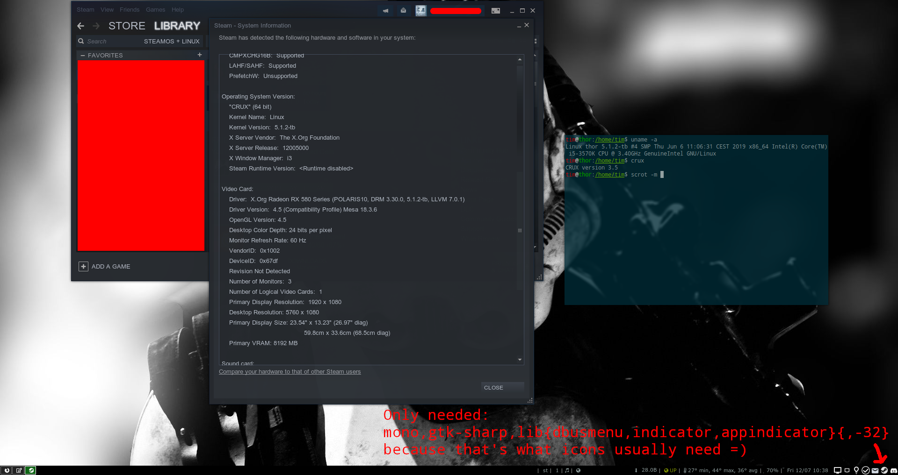

# crux-steam

It works!

Only for internal use and show casing :D

# To Do

*  networkmanager-32
*  udev
*  libnewt uses git as a source, it's based on tb/libnewt, maybe I should revisit them
*  port libsdl2-32
*  does libsoup-32 need those two check lines for vala-32 and krb5-32?
*  python3-32 needs some checking
*  rtmpdump-32 uses git as a source
*  maybe I pulled avahi-32 by mistake?
  * it doesn't build right now, but it did build, which is most curious..
*  appindicator in i3bar does not show
*  clean up
  * not quiet sure how to put deps, findeps is no help. the big brother in case plus maybe python or whatever?
  * cleaned up most Pkgfiles (didn't put deps yet)
* Darkest Dungeon seems to run, but DOOM (the new one) which depends on Steam Proton (wine :D) doesn't
  * Total War: Warhammer runs (native feral port) fine as is too

# Notes

14:10 < Romster> https://wiki.archlinux.org/index.php/Steam/Troubleshooting
14:10 < Romster> cd ~/.steam/root/ubuntu12_32
14:10 < Romster> file * | grep ELF | cut -d: -f1 | LD_LIBRARY_PATH=. xargs ldd | grep 'not found' | sort | uniq
14:11 < Romster> DEBUGGER=gdb steam also works for debugging

14:13 < Romster> Ilibnm-glib.so.4 => not found
14:13 < Romster> Ilibnm-util.so.2 => not found
14:13 < Romster> Ilibudev.so.0 => not found

14:17 < Romster> be sure to strip all the binarys and foo.so and just keep the libnm-glib.so.4 libnm-util.so.2 libudev.so.0 libswithout the symlink to .so

14:29 < Romster> prtverify -m missing-deps -m file-conflict -c /usr/ports/core -c /usr/ports/opt -c /usr/ports/xorg/ -c /usr/ports/compat-32/ -c /usr/ports/contrib/ -c /usr/ports/compat-32/ .

-> I need to add my personal REPOS to that
prtverify -m missing-deps -m file-conflict -c /usr/ports/core -c /usr/ports/opt -c /usr/ports/xorg/ -c /usr/ports/compat-32/ -c /usr/ports/contrib/ -c /usr/ports/compat-32/ -c /usr/ports/tb -c /usr/ports/overlay .

And -c /usr/ports/steam ?
